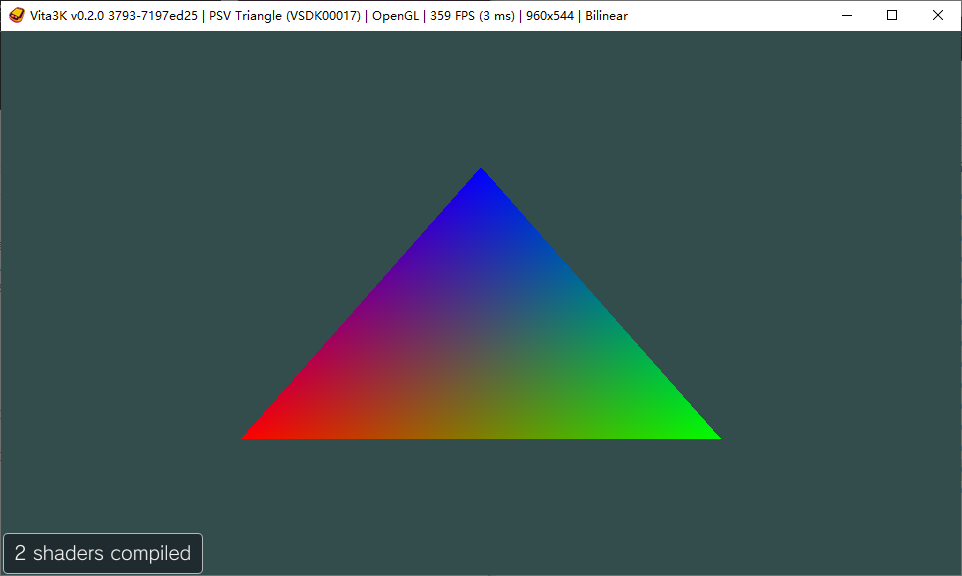

# PSV_helloworld



A basic psv app

# Config PSX toolchain

1. Setup environment variable `VITASDK`
    ```bash
    # VITASDK is the install destination for Vita SDK
    export VITASDK=/usr/local/vitasdk 
    export PATH=$VITASDK/bin:$PATH # add vitasdk tool to $PATH
    ```
2. Download [Vita host package manager](https://github.com/vitasdk/vdpm)
    ```bash
    git clone https://github.com/vitasdk/vdpm
    cd vdpm
    ./bootstrap-vitasdk.sh
    ./install-all.sh
    ```

# Referencs
- https://vitasdk.org/
- https://github.com/vitasdk/samples
- https://github.com/vitasdk/vita-toolchain
- https://github.com/vitasdk/vdpm
- https://github.com/vitasdk/buildscripts
- [vita3k](https://vita3k.org/)
